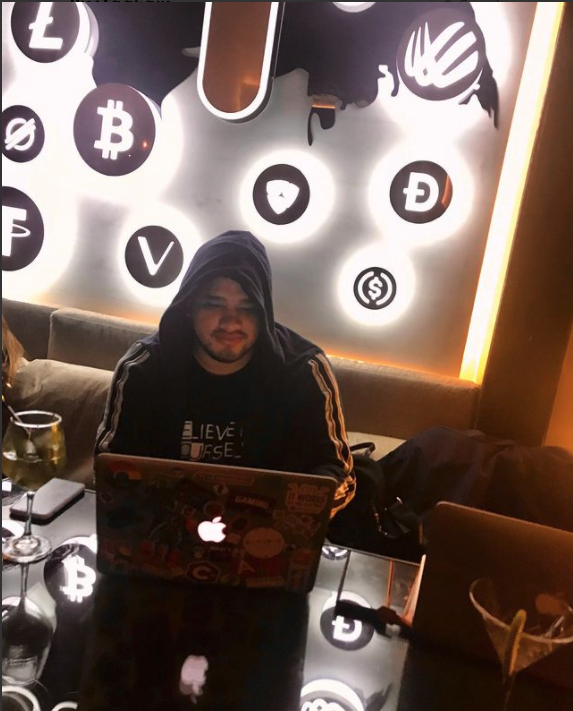

<h1 align="center">Junior Rojas</h1>

<p align="center">
  <strong>Founder & CEO at <a href="https://intechchain.com">IntechChain</a></strong><br/>
  Blockchain Solutions &middot; AI Agents &middot; Fintech Products
</p>

<p align="center">
  <a href="https://twitter.com/rojasjuniore"></a>
  <a href="https://www.linkedin.com/in/rojasjuniore/"></a>
  <a href="https://www.instagram.com/its.juniorrojas/"></a>
</p>

---



### About

Full Stack & Blockchain Developer based in Medellin, Colombia. I build fintech and Web3 products for LATAM through **[IntechChain](https://intechchain.com)** — a blockchain services company focused on tokenization, smart contracts, and AI-powered tools.

Currently exploring the intersection of **AI Agents** and **crypto payments**, building skills and tools that let autonomous agents transact with USDC, manage wallets, and interact with DeFi protocols.

### What I'm building

- **Real Estate Tokenization** — White-label platform for tokenizing real-world assets
- **AI Agent Payments** — USDC payment skills for autonomous AI agents (PayClaw, AgentPay)
- **AgentVault** — On-chain AI Agent Registry on Solana (profiles, reputation, trust)
- **Brand Factory** — AI-powered brand identity generator
- **GH Points EAFIT** — Gamification system for university organizations

### Tech stack

```text
Languages     TypeScript · JavaScript · Solidity · Rust · Python
Frontend      Angular · React · Next.js · Tailwind CSS
Backend       Node.js · Express · NestJS · FastAPI
Blockchain    Ethereum · Solana · Starknet · Hardhat · Foundry
AI / Agents   Claude Code · OpenClaw · LangChain · FinBERT
Cloud         Firebase · AWS · Vercel · Docker · Railway
Data          MongoDB · PostgreSQL · Firestore
```

### GitHub activity

<p align="center">
  
  
</p>

<p align="center">
  
</p>

---

<p align="center">
  <sub>147 public repos &middot; 8,300+ contributions this year &middot; Shipping from Medellin 🇨🇴</sub>
</p>
